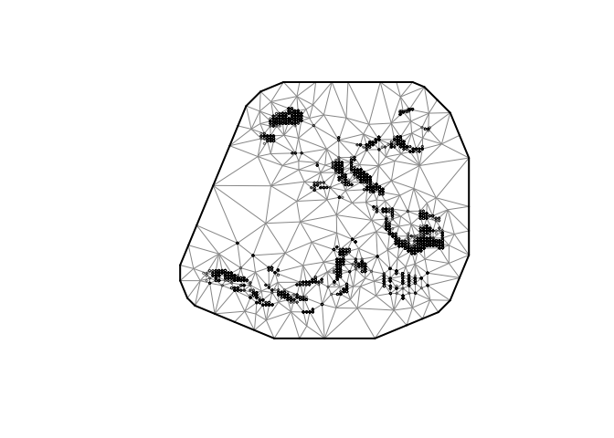
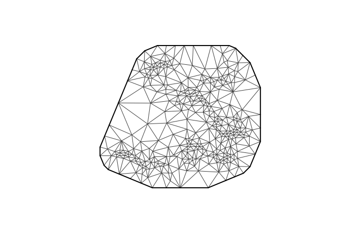
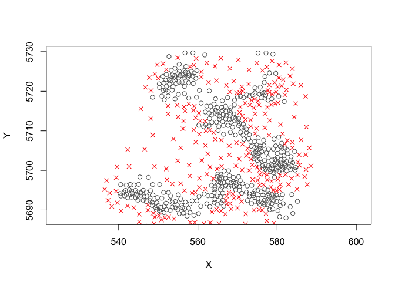
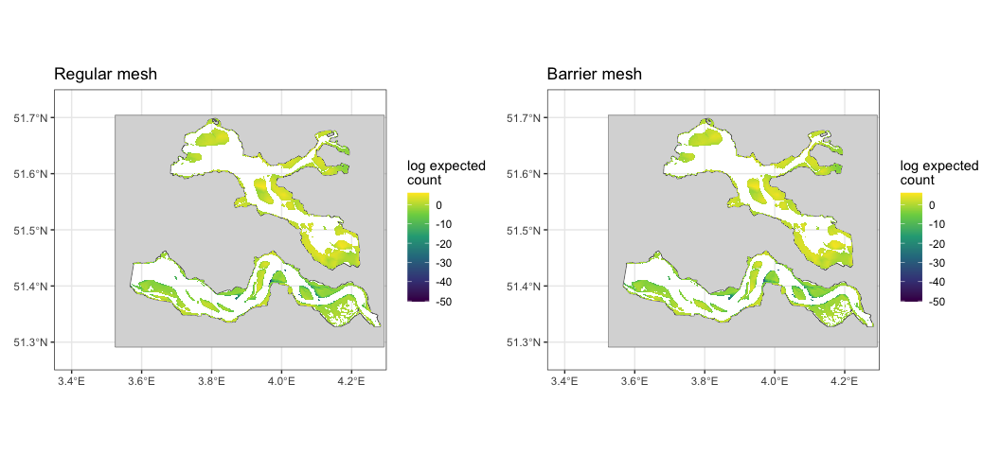

# Barrier_Exercise
Alicia Hamer

# Case study: shellfish in two tidal inlets separated by a barrier

The Oosterschelde and Westerschelde are two adjacent tidal systems in
the Dutch Delta. Although they are spatially close, they are physically
separated by land so spatial correlation in shellfish density should
*not* flow freely across the peninsula, even where two sampling points
are close in straight-line distance. This case study tests whether
encoding that barrier in the spatial mesh improves a species
distribution model for the Common Cockle (*Cerastoderma edule*).

The data come from the annual intertidal **Kokkelsurvey**, conducted
each spring by Wageningen Marine Research. Depending on the tide at the
moment of sampling, either a *kokkelschepje* or a *steekbuis* is used to
take the sample.

We fit two otherwise-identical `sdmTMB` models: one on a regular SPDE
mesh and one on a barrier mesh, and compare.

# 0. Information on Survey:

Monster Identifier: replicate.id Monster surface area:

## Settings

Here we can choose the survey and the species, for this case study the
Kokkelsurvey in the spring and the Common Cockle (Cerastoderma edule)
might be most interesting. (*Ruditapes* is an invasive species, so
probably less suitable).

``` r
#    Settings

Surveyx        = c("KokkelSurveyVoorjaar", "KokkelSurveyNajaar", "Oestersurvey")[1] #I removed other surveys so this does not do anything right now
crs_chosen     =    4326   #WGS84
Species_chosen = c("Cerastoderma edule", "Macoma balthica", "Ruditapes philippinarum", "Abra tenuis")[3]
```

## Load libraries

``` r
x <- c("ggplot2", "tidyverse", "vegan", "sf", "raster", "terra", "tidyterra","glmmTMB",
       "dplyr", "tidyr", "sdmTMB", "DHARMa")                  
invisible(lapply(x, require, character.only = TRUE))

#Set Theme
theme_set(theme_bw())                           

#Directories
path          <- getwd()
pathfigures   <- paste0(path,"/Fig")
```

## Read Survey data

Read the Oosterschelde and Westerschelde survey files separately, drop
the Wadden Sea stations from the Westerschelde file (they share a survey
but are outside this case study), and merge the two systems into one
table.

``` r
#Oosterschelde
df_WOT_OS <- read_csv(paste0(path, "/data/SpeciesData/ShelfishSurvey/df_WOT_os.csv")) %>% 
  dplyr::mutate(locatie.nr = as.character(locatie.nr)) %>% 
  dplyr::mutate(Systeem = "Oosterschelde")

#Westerschelde 
#cutting of the Waddensea samples (They belong to the same survey as the Westerschelde but aren't part of the case study)
df_WOT_WS <- read_csv(paste0(path, "/data/SpeciesData/ShelfishSurvey/df_WOT_ws.csv")) %>% 
  dplyr::filter(Latitude < 52.0) %>% 
  dplyr::mutate(locatie.nr = as.character(locatie.nr)) %>% 
  dplyr::mutate(Systeem = "Westerschelde")
  
#Merge the two systems
df_WOT <- dplyr::bind_rows(df_WOT_OS, df_WOT_WS)

#Remove size/age classes (so there are not multiple rows per unique ID)
# this was already done

#Select Survey and Merge Sampling methos
df_WOT <- df_WOT %>% mutate(
  Tuig = dplyr::case_when(
    Tuig %in% c("Kokkelschepje 1 Regulus",
                "Kokkelschepje 2 Luctor",
                "Kokkelschepje 3 reserve",
                "kokkelschuifje")              ~ "Kokkelschepje",
    Tuig %in% c("steekbuis (pvc-buis)")        ~ "Steekbuis",
    TRUE                                       ~ "Overig"   # ring, OesterHapper, etc.
  ), Tuig = factor(Tuig)) %>%
  dplyr::filter(project.id %in% c(4,5)) %>%   # these numbers are the survey identifiers
  dplyr::filter(seizoen == "vj")              #only spring as this is the long term survey (vj stands for voorjaar)


#Turn it into a spatial object
df_WOT_sf  <- st_as_sf(df_WOT, coords = c("Longitude","Latitude"), crs = crs_chosen, remove = FALSE)
```

## Read Env data

The main covariate is emersion time (*DVD -\> Droogvalduur (Dutch)*),
supplied as rasters per system. We reproject both to WGS84, merge them,
and load the land barrier shapefile (cropped to the study extent) for
use in plotting and in the barrier mesh.

``` r
#Emersion time       (Unit is percentage % of time emerged)
dvd_OS       <- terra::rast(paste0(path, "/Data/EnvironData/Rasters_EmersionTimes", "/edvd_os_2021.tif"))
dvd_WS       <- terra::rast(paste0(path, "/Data/EnvironData/Rasters_EmersionTimes", "/edvd_ws_2022.tif"))

#convert from rd new to wgs84
dvd <- terra::merge(terra::sprc(dvd_OS, dvd_WS))
dvd <- terra::project(dvd, "EPSG:4326", method = "bilinear")

# Create breaks
breaks <- c(0,5,10,15,20,25,30,35,40,45,50,60,70,80,90,100)


#Flow Velocity      (Unit is m/sec)
evmax_OS       <- terra::rast(paste0(path, "/Data/EnvironData/Rasters_EvMax", "/evmax_os_2021.tif"))
evmax_OS <- terra::resample(evmax_OS, dvd_OS, method = "bilinear")  # align grids
evmax_OS <- terra::mask(evmax_OS, dvd_OS)

evmax_WS <- terra::rast(paste0(path, "/Data/EnvironData/Rasters_EvMax", "/evmax_ws_2022.tif"))
evmax_WS <- terra::resample(evmax_WS, dvd_WS, method = "bilinear") 
evmax_WS <- terra::mask(evmax_WS, dvd_WS)

#convert from rd new to wgs84
ev_max <- terra::merge(terra::sprc(evmax_OS, evmax_WS))
ev_max <- terra::project(ev_max, "EPSG:4326", method = "bilinear")
#very important step I forgot! 
ev_max <- ev_max/100 

#Barrier_Shapefile   -> this marks the tidal flats as barriers and that is not what we want
Barrier            <- st_read(paste0(path, "/Data/EnvironData/Shapefile_Boundary", "/Nederland.shp")) 
```

    Reading layer `Nederland' from data source 
      `/Users/aliciahamer/Library/CloudStorage/OneDrive-WageningenUniversity&Research/20xx_Overige Projecten/Curssussen/WKFISHDISH/Tor B - SDM methodology and good practices/Theme-2/CaseStudy_Barrier/sdm-barrier/Data/EnvironData/Shapefile_Boundary/Nederland.shp' 
      using driver `ESRI Shapefile'
    Simple feature collection with 37 features and 4 fields
    Geometry type: MULTIPOLYGON
    Dimension:     XY
    Bounding box:  xmin: 524976.5 ymin: 5626017 xmax: 782918.9 ymax: 5939887
    CRS:           NA

``` r
st_crs(Barrier)    <- 32631  
Barrier            <- st_transform(Barrier, crs_chosen)

#Cut it
Barrier           <- st_geometry(Barrier)
Barrier           <- st_make_valid(Barrier)
Barrier           <- st_crop(Barrier, c(xmin = 3.35, ymin = 51.25, xmax = 4.30, ymax = 51.75))

#Construct barrier from Emersion time (dvd) grid layer
land_rast <- terra::ifel(is.na(dvd), 1, NA)        # 1 where dvd is NA (= land), NA elsewhere
land      <- terra::as.polygons(land_rast)          # polygon of the land
land      <- sf::st_as_sf(land)                      # to sf, inherits dvd's CRS (4326)
land      <- sf::st_make_valid(land)
#plot(sf::st_geometry(land), col = "tomato", border = "grey40")

Barrier   <- land


rm(list = setdiff(ls(), c("df_WOT", "df_WOT_sf", "MB_perLocation",         #data
                          "Barrier", "dvd", "ev_max",                      #spatial data
                          "path", "pathfigures",                           #paths
                          "Species_chosen", "Surveyx", "breaks"            #settings
                          )))
```

# Area description

## Area description - Spatially

The westerschelde is more dynamic (larger flow velocities) and has a
salinity gradient, the oosterschelde is less dynamic and no salinity
gradient. Both are tidal systems.

The map below shows the emersion-time surface, the land barrier
separating the two inlets, and the survey stations coloured by sampling
gear.

``` r
p1 <- ggplot() +
  # Emersion-time raster
  tidyterra::geom_spatraster(data = dvd) +
  scale_fill_viridis_c(
    name    = "Droogvalduur (%)",
    breaks  = breaks,
    na.value = "transparent") +
    scale_fill_binned(palette =  c("#08306B","#08519C","#2171B5","#4292C6","#6BAED6",
                                   "#9ECAE1","#C6DBEF","#DEEBF7","#F7FBFF", 
                                   "lightyellow","lightyellow1","lightyellow2",
                                   "lightyellow3","lightyellow4", "yellow4",NA),
                      breaks = breaks,
                      na.value = "white") +
  # Land
  geom_sf(data = Barrier, fill = "grey85", colour = "grey40", linewidth = 0.2) +
  # Survey points
  geom_sf(data = df_WOT_sf, aes(colour = Tuig), size = 0.6, alpha = 0.6) +
  coord_sf(xlim = c(3.35, 4.30), ylim = c(51.25, 51.75), expand = FALSE) +
  labs(x = NULL, y = NULL) +
  theme_bw()
```

    <SpatRaster> resampled to 500835 cells.
    Scale for fill is already present.
    Adding another scale for fill, which will replace the existing scale.

``` r
 p1 <- p1 + scale_color_manual(values = c("Kokkelschepje"               = "#582f0e",    
                                        "Steekbuis"                     = "#2171B5", # "#bc4749"
                                        "Overig"                        = "#FDE725"))  

print(p1)
```


## Area description - Table

``` r
#| message: false

# One row per event, tagged by system (OS east, WS west — they split on longitude).
events_tagged <- df_WOT %>%
  dplyr::distinct(replicate.id, .keep_all = TRUE)

# --- 1. Samples per system per year ---
samples_per_system <- events_tagged %>%
  dplyr::count(Year, Systeem) %>%
  tidyr::pivot_wider(names_from = Systeem, values_from = n, values_fill = 0) %>%
  dplyr::arrange(Year)

knitr::kable(samples_per_system,
             caption = "Number of survey samples per system per year")
```

| Year | Oosterschelde | Westerschelde |
|-----:|--------------:|--------------:|
| 2014 |           255 |           158 |
| 2015 |           261 |           145 |
| 2016 |           252 |           157 |
| 2017 |           243 |           145 |
| 2018 |           259 |           163 |
| 2019 |           262 |           163 |
| 2020 |           269 |           149 |
| 2021 |           237 |           134 |
| 2022 |           243 |           154 |
| 2023 |           266 |           150 |
| 2024 |           284 |           140 |

Number of survey samples per system per year

``` r
# --- 2. Sampled environment (dvd, evmax) per system ---
env_per_system <- events_tagged %>%
  dplyr::filter(!is.na(dvd), !is.na(evmax)) %>%
  dplyr::group_by(Systeem) %>%
  dplyr::summarise(
    n          = dplyr::n(),
    dvd_mean   = mean(dvd),   dvd_sd   = sd(dvd),
    evmax_mean = mean(evmax), evmax_sd = sd(evmax),
    .groups = "drop"
  )

knitr::kable(env_per_system, digits = 2,
             caption = "Sampled emersion time (dvd) and max flow velocity (evmax) by system")
```

| Systeem       |    n | dvd_mean | dvd_sd | evmax_mean | evmax_sd |
|:--------------|-----:|---------:|-------:|-----------:|---------:|
| Oosterschelde | 2830 |    39.12 |  19.95 |       0.34 |     0.10 |
| Westerschelde | 1658 |    47.35 |  26.49 |       0.47 |     0.25 |

Sampled emersion time (dvd) and max flow velocity (evmax) by system

# Model

Prepare data for model

``` r
events <- df_WOT %>%
  group_by(replicate.id) %>%
  dplyr::summarise(
    Year      = first(Year),
    Longitude = first(Longitude),
    Latitude  = first(Latitude),
    dvd       = first(dvd),
    evmax     = first(evmax),
    Tuig      = first(Tuig),          
    seizoen   = first(seizoen),       
    opp_m2    = first(opp_bemonsterd_m2),
    .groups = "drop"
  )

cockle_counts <- df_WOT %>%
  filter(TaxonName_ACC == Species_chosen) %>%
  group_by(replicate.id) %>%
  dplyr::summarise(count = sum(SumOfNumber, na.rm = TRUE), .groups = "drop")

dat <- events %>%
  left_join(cockle_counts, by = "replicate.id") %>%
  mutate(count = ifelse(is.na(count), 0L, count))

cat("Events with cockles:", sum(dat$count > 0),
    " | true zeros:", sum(dat$count == 0), "\n")
```

    Events with cockles: 1100  | true zeros: 3389 

``` r
dat <- dat %>%
  filter(!is.na(dvd), !is.na(evmax),
         !is.na(Longitude), !is.na(Latitude), !is.na(opp_m2)) %>%
  mutate(
    dvd_s    = as.numeric(scale(dvd)),     
    evmax_s  = as.numeric(scale(evmax)),   
    log_area = log(opp_m2),                
    gear     = factor(Tuig),
    season   = factor(seizoen),
    fYear    = factor(Year)
  )

## Project lon/lat -> metric CRS (UTM 31N) so mesh & range are in km.
dat <- add_utm_columns(dat, ll_names = c("Longitude", "Latitude"),
                       utm_crs = 32631)   # adds X, Y (km)
```

## Constructing a Barrier Mesh

Build a regular SPDE mesh first, then derive a barrier mesh from it by
passing the land polygon to `add_barrier_mesh()`. The `range_fraction`
shrinks the spatial range across the barrier (lower = stronger barrier),
so correlation no longer leaks across land.

``` r
#first the regular mesh
mesh <- sdmTMB::make_mesh(dat, xy_cols = c("X", "Y"), cutoff = 0.75)
plot(mesh); cat("Mesh vertices:", mesh$mesh$n, "\n")
```



    Mesh vertices: 353 

``` r
plot(mesh$mesh, main = "Regular mesh", asp = 1)
```



``` r
Barrier <- sf::st_sf(geometry = Barrier)
#needs tobe mesh units (utm)
Barrier_km <- sf::st_transform(Barrier, 32631)    # metres
sf::st_geometry(Barrier_km) <- sf::st_geometry(Barrier_km) * 1e-3       # -> km to match mesh X/Y
sf::st_crs(Barrier_km) <- NA                      

#Then a Barrier mesh
barrier_mesh <- sdmTMBextra::add_barrier_mesh(
  spde_obj    = mesh,
  barrier_sf  = Barrier_km,       
  range_fraction = 0.2,         # barrier range = 0.2 * estimated range
  proj_scaling = 1,              # ??
  plot = TRUE
)
```



``` r
#plot(barrier_mesh$mesh, main = "Barrier mesh")
```

## Fitting a model

``` r
# --- Fit both models 
fit_plain <- sdmTMB(
  count ~ poly(dvd_s, 2) + poly(evmax_s, 2) + gear + fYear,
  data   = dat,
  mesh   = mesh,
  family = nbinom2(link = "log"),
  offset  = dat$log_area,
  spatial = "on"
)

fit_barrier <- sdmTMB(
  count ~ poly(dvd_s, 2) + poly(evmax_s, 2) + gear + fYear,
  data   = dat,
  mesh   = barrier_mesh,    
  family = nbinom2(link = "log"),
  offset  = dat$log_area,
  spatial = "on"
)
```

## Predicting with model

Build the prediction grid from the emersion-time raster (so every
prediction cell has a real `dvd` value), and predict from each model. I
remove subtidal area from prediction grid, as the survey is intertidal.

``` r
# Coarsen the emersion raster a little so prediction is quick,

# --- dvd grid
dvd_coarse     <- terra::aggregate(dvd, fact = 4, fun = "mean", na.rm = TRUE)
grid           <- terra::as.data.frame(dvd_coarse, xy = TRUE, na.rm = TRUE)
names(grid)[3] <- "dvd"

# --- pull evmax 
evmax_coarse <- terra::resample(ev_max, dvd_coarse, method = "bilinear")
grid$evmax   <- terra::extract(evmax_coarse,
                               grid[, c("x", "y")])[, 2] 

# drop cells where evmax is missing and filter out subtidal area for prediction grid -> not sure is this is best practice
grid <- grid[!is.na(grid$evmax), ]
grid <- grid[grid$dvd > 0 & grid$dvd < 97, ]

# --- scale BOTH using the fitting means/sds ---
dvd_mean   <- mean(dat$dvd,   na.rm = TRUE); dvd_sd   <- sd(dat$dvd,   na.rm = TRUE)
evmax_mean <- mean(dat$evmax, na.rm = TRUE); evmax_sd <- sd(dat$evmax, na.rm = TRUE)

grid <- grid %>%
  dplyr::rename(Longitude = x, Latitude = y) %>%
  dplyr::mutate(
    dvd_s   = (dvd   - dvd_mean)   / dvd_sd,
    evmax_s = (evmax - evmax_mean) / evmax_sd
  )

# gear still held at reference level 
grid$gear <- factor(levels(dat$gear)[1], levels = levels(dat$gear))
grid$log_area <- 0          

grid$fYear <- factor(2021, levels = levels(dat$fYear))

grid <- add_utm_columns(grid, ll_names = c("Longitude", "Latitude"),
                        utm_crs = 32631)

cat("Prediction cells:", nrow(grid), "\n")
```

    Prediction cells: 35208 

# Comparison

## Performance

``` r
sanity(fit_plain)
sanity(fit_barrier)

print(fit_plain)
```

    Spatial model fit by ML ['sdmTMB']
    Formula: count ~ poly(dvd_s, 2) + poly(evmax_s, 2) + gear + fYear
    Mesh: mesh (isotropic covariance)
    Data: dat
    Family: nbinom2(link = 'log')
     
    Conditional model:
                      coef.est coef.se
    (Intercept)          -1.65    0.52
    poly(dvd_s, 2)1      33.35    8.79
    poly(dvd_s, 2)2     -17.74    5.75
    poly(evmax_s, 2)1   -56.58   15.63
    poly(evmax_s, 2)2   -66.61   14.96
    gearOverig           -0.65    0.22
    gearSteekbuis         0.10    0.96
    fYear2015             0.86    0.24
    fYear2016             1.47    0.23
    fYear2017             1.31    0.24
    fYear2018             1.61    0.23
    fYear2019             1.76    0.23
    fYear2020             1.99    0.23
    fYear2021             1.94    0.23
    fYear2022             1.97    0.23
    fYear2023             2.56    0.23
    fYear2024             2.82    0.23

    Dispersion parameter: 0.32
    Matérn range: 4.06
    Spatial SD: 2.95
    ML criterion at convergence: 4352.509

    See ?tidy.sdmTMB to extract these values as a data frame.

``` r
print(fit_barrier)
```

    Spatial model fit by ML ['sdmTMB']
    Formula: count ~ poly(dvd_s, 2) + poly(evmax_s, 2) + gear + fYear
    Mesh: barrier_mesh (isotropic covariance)
    Data: dat
    Family: nbinom2(link = 'log')
     
    Conditional model:
                      coef.est coef.se
    (Intercept)          -2.00    0.57
    poly(dvd_s, 2)1      34.72    8.91
    poly(dvd_s, 2)2     -17.24    5.75
    poly(evmax_s, 2)1   -56.57   15.93
    poly(evmax_s, 2)2   -68.61   15.21
    gearOverig           -0.65    0.23
    gearSteekbuis         0.13    0.96
    fYear2015             0.86    0.24
    fYear2016             1.46    0.23
    fYear2017             1.31    0.24
    fYear2018             1.62    0.23
    fYear2019             1.77    0.23
    fYear2020             1.98    0.23
    fYear2021             1.94    0.23
    fYear2022             1.98    0.23
    fYear2023             2.56    0.23
    fYear2024             2.82    0.23

    Dispersion parameter: 0.32
    Matérn range: 4.20
    Spatial SD: 2.64
    ML criterion at convergence: 4358.062

    See ?tidy.sdmTMB to extract these values as a data frame.

``` r
# AIC 
AIC(fit_plain, fit_barrier)  
```

                df      AIC
    fit_plain   20 8745.018
    fit_barrier 20 8756.123

``` r
#DHARMa residuals  
s1 <- simulate(fit_plain,   nsim = 300, type = "mle-mvn")
s2 <- simulate(fit_barrier, nsim = 300, type = "mle-mvn")

r1 <- dharma_residuals(s1, fit_plain,   return_DHARMa = TRUE)
r2 <- dharma_residuals(s2, fit_barrier, return_DHARMa = TRUE)

DHARMa::testResiduals(r1)
```


    $uniformity

        Asymptotic one-sample Kolmogorov-Smirnov test

    data:  simulationOutput$scaledResiduals
    D = 0.014023, p-value = 0.3406
    alternative hypothesis: two-sided


    $dispersion

        DHARMa nonparametric dispersion test via sd of residuals fitted vs.
        simulated

    data:  simulationOutput
    dispersion = 0.80153, p-value = 0.9133
    alternative hypothesis: two.sided


    $outliers

        DHARMa outlier test based on exact binomial test with approximate
        expectations

    data:  simulationOutput
    outliers at both margin(s) = 40, observations = 4488, p-value = 0.06566
    alternative hypothesis: true probability of success is not equal to 0.006644518
    95 percent confidence interval:
     0.006374749 0.012116924
    sample estimates:
    frequency of outliers (expected: 0.00664451827242525 ) 
                                               0.008912656 

``` r
DHARMa::testResiduals(r2)
```


    $uniformity

        Asymptotic one-sample Kolmogorov-Smirnov test

    data:  simulationOutput$scaledResiduals
    D = 0.015741, p-value = 0.2161
    alternative hypothesis: two-sided


    $dispersion

        DHARMa nonparametric dispersion test via sd of residuals fitted vs.
        simulated

    data:  simulationOutput
    dispersion = 0.60995, p-value = 0.58
    alternative hypothesis: two.sided


    $outliers

        DHARMa outlier test based on exact binomial test with approximate
        expectations

    data:  simulationOutput
    outliers at both margin(s) = 41, observations = 4488, p-value = 0.05263
    alternative hypothesis: true probability of success is not equal to 0.006644518
    95 percent confidence interval:
     0.006563523 0.012373090
    sample estimates:
    frequency of outliers (expected: 0.00664451827242525 ) 
                                               0.009135472 

``` r
#DHARMa::testSpatialAutocorrelation(r1, x = dat$X, y = dat$Y)
#DHARMa::testSpatialAutocorrelation(r2, x = dat$X, y = dat$Y)

#S
tidy(fit_plain,   "ran_pars", conf.int = TRUE)
```

    # A tibble: 3 × 5
      term    estimate std.error conf.low conf.high
      <chr>      <dbl>     <dbl>    <dbl>     <dbl>
    1 range      4.06     0.738     2.84      5.80 
    2 phi        0.319    0.0158    0.289     0.351
    3 sigma_O    2.95     0.341     2.35      3.70 

``` r
tidy(fit_barrier, "ran_pars", conf.int = TRUE)
```

    # A tibble: 3 × 5
      term    estimate std.error conf.low conf.high
      <chr>      <dbl>     <dbl>    <dbl>     <dbl>
    1 range      4.20     0.770     2.94      6.02 
    2 phi        0.318    0.0158    0.288     0.350
    3 sigma_O    2.64     0.357     2.03      3.44 

## Prediction

``` r
pred_plain   <- predict(fit_plain,   newdata = grid)
```

    Fitted object contains an offset but the offset is `NULL` in `predict.sdmTMB()`
    and `newdata` were supplied.
    Prediction will proceed assuming the offset vector is 0 in the prediction.
    Specify an offset vector in `predict.sdmTMB()` to override this.

``` r
pred_barrier <- predict(fit_barrier, newdata = grid)
```

    Fitted object contains an offset but the offset is `NULL` in `predict.sdmTMB()`
    and `newdata` were supplied.
    Prediction will proceed assuming the offset vector is 0 in the prediction.
    Specify an offset vector in `predict.sdmTMB()` to override this.

``` r
pred_plain$density   <- exp(pred_plain$est)
pred_barrier$density <- exp(pred_barrier$est)
```

## Predicted density surfaces

``` r
zlim <- range(c(pred_plain$est, pred_barrier$est), na.rm = TRUE)

base_map <- function(df, title) {
  ggplot(df, aes(Longitude, Latitude, fill = est)) +
    geom_sf(data = Barrier, fill = "grey85", colour = "grey40",
            linewidth = 0.2, inherit.aes = FALSE) +
    geom_raster() +
    scale_fill_viridis_c(name = "log expected\ncount",
                         limits = zlim) +             
    coord_sf(xlim = c(3.35, 4.30), ylim = c(51.25, 51.75), expand = FALSE) +
    labs(title = title, x = NULL, y = NULL) +
    theme_bw()
}

p_plain   <- base_map(pred_plain,   "Regular mesh")
p_barrier <- base_map(pred_barrier, "Barrier mesh")

library(patchwork)
```


    Attaching package: 'patchwork'

    The following object is masked from 'package:terra':

        area

    The following object is masked from 'package:raster':

        area

``` r
p_plain + p_barrier
```

    Warning: Raster pixels are placed at uneven horizontal intervals and will be shifted
    ℹ Consider using `geom_tile()` instead.
    Raster pixels are placed at uneven horizontal intervals and will be shifted
    ℹ Consider using `geom_tile()` instead.



## 

## Reccomendations

Next year (?), the DFS data could be added to explore if mesh/barrier
mesh shows a difference in fish species, maybe moving species could
react differently?
